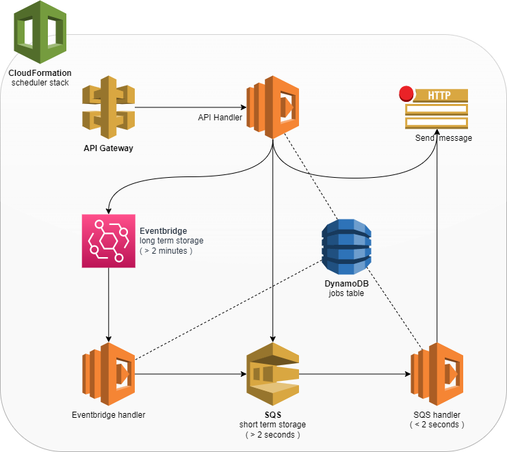

# Serverless scheduler

A completely serverless, high-precision scheduler for ad hoc jobs.

## Usage

Send a POST request the to scheduler endpoint with at least the following payload:

```js
{
  "endpoint": "http://example.com/my-webhook",
  "scheduleAt": "2021-08-21T22:00:00.000+0200"
}
```

The scheduler will make a HTTP request to the defined endpoint soon after the timestamp.

## Architecture

A combination of DynamoDBs TTL and SQS' Message Delays is used to reach a precision close to seconds while maintaining a serverless approach that truly scales.

## Architecture

Job details are stored in DynamoDB while the scheduling is managed by a combination of Eventbridge schedules and SQS' Message Delays to reach a precision close to 1 second while maintaining a serverless approach that truly scales.



## Deploying to AWS

> ⚠ **Attention**
>
> The scheduler exposes a public API that can be used by anyone. If you intend on deploying this project to production you should add an authorizer of your choice to the API Gateway.

1. Clone this repo

1. Copy `.example.env` to `.env`. Modify as you see fit.

1. Search-replace `irish-luck` in `MakeFile` with the name of your S3 bucket.

1. ```bash
    make deploy
    ```

## SaaS Alternatives

If you're not comfortable running your own service there are hosted schedulers that will do it for you. 💸

* [Cronhooks](https://cronhooks.io/) - One scheduled hook at a time included in free plan
* [Posthook](https://posthook.io/) - 500 free requests per month
